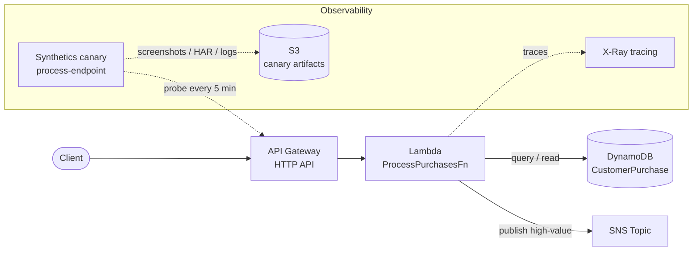

# A simple example of trying AWS CloudWatch X-Ray + Synthetics

A tiny e-commerce demo that wires up **DynamoDB → Lambda → SNS** behind an HTTP API,
with **X-Ray tracing** on the function and a **CloudWatch Synthetics canary** probing
the endpoint every 5 minutes. Deployed with AWS SAM.

## Architecture



## Project layout

```txt
observability-workshop-light/
├── template.yaml           # SAM template (DynamoDB, Lambda, SNS, HTTP API, canary)
├── devbox.json             # dev environment (uv, awscli2, sam deps, python@3.12)
├── src/
│   ├── lambda_function.py  # the handler (queries DynamoDB, filters, publishes to SNS)
│   └── requirements.txt    # runtime dependency (aws-xray-sdk)
└── README.md
```

The Lambda source lives under `src/` so SAM's `CodeUri: src/` packages only the
handler and its dependencies — not the whole workspace.

## Prerequisites

- [devbox](https://www.jetify.com/docs/devbox/) + [direnv] (this repo's `.envrc` loads it)
- AWS credentials. This project uses a named profile; set it in `.env.local`:
  ```sh
  export AWS_PROFILE=<your-profile>
  ```
- The SAM CLI and AWS CLI come from `devbox.json`. If you're not using devbox,
  install the SAM CLI separately (`brew install aws-sam-cli`).

## Commands guide

### 1. Set up the Python environment (one time)

SAM's Python builder needs a `python3.12` interpreter **with pip** on `PATH`. The
devbox/nix python ships without pip, so create a virtualenv and activate it before
building:

```sh
python3.12 -m venv .venv
source .venv/bin/activate      # activate in each shell before `sam build`
python -m pip --version        # sanity check: should report pip for python 3.12
```

> Tip: activating `.venv` puts a pip-enabled `python3.12` first on `PATH`, which is
> what `sam build` looks for. Without it you'll hit
> `PythonPipBuilder:ResolveDependencies - Failed to find a Python runtime containing pip`.

### 2. Build

```sh
sam build
```

Re-run `sam build` after **any** change to `template.yaml` or the function code —
`sam deploy` ships the built artifacts under `.aws-sam/`, not your source files.

### 3. Deploy

First deploy (interactive; saves answers to `samconfig.toml`):

```sh
sam deploy --guided
```

When prompted **`ProcessPurchasesFn has no authentication. Is this okay?`** answer
**`y`** — the `/process` route is intentionally public so the canary can probe it.

Subsequent deploys reuse the saved config:

```sh
sam deploy
```

### 4. Seed data and call the endpoint

```sh
# seed a purchase row (Amount >= threshold gets forwarded to SNS)
aws dynamodb put-item --table-name CustomerPurchase \
  --item '{"CustomerId":{"S":"1"},"PurchaseId":{"S":"p-001"},"Amount":{"N":"150"},"Product":{"S":"Keyboard"}}'

# call the API (URL is in the stack outputs as ApiUrl)
curl "https://<api-id>.execute-api.us-east-1.amazonaws.com/process?customerId=1"
```

### 5. Invoke the function directly

```sh
sam remote invoke ProcessPurchasesFn
# or:
aws lambda invoke --function-name <FunctionName-from-outputs> out.json
```

### 6. Tear down

The canary runs every 5 minutes indefinitely and the stack keeps DynamoDB, SNS,
and an S3 bucket around — delete the stack when you're done to stop the cost.

The canary writes artifacts to its S3 bucket, and CloudFormation can't delete a
**non-empty** bucket, so empty it first, then delete the stack:

```sh
# 1. find the canary artifact bucket name
aws cloudformation describe-stack-resources --stack-name test-sam-deploy \
  --query "StackResources[?ResourceType=='AWS::S3::Bucket'].PhysicalResourceId" --output text

# 2. empty it
aws s3 rm s3://<canary-artifact-bucket> --recursive

# 3. delete the whole stack (canary, Lambda, DynamoDB, SNS, API, IAM role, bucket)
sam delete --stack-name test-sam-deploy
```

Local build/venv artifacts (safe to remove any time):

```sh
chmod -R u+w .aws-sam 2>/dev/null; rm -rf .aws-sam   # SAM build output
rm -rf .venv                                          # the virtualenv
```

## Observability

- **X-Ray** — the handler calls `patch_all()` and the function has `Tracing: Active`,
  so traces show up in the X-Ray service map (CloudWatch → X-Ray traces).
- **Synthetics canary** — `process-endpoint` probes `/process` every 5 minutes;
  view runs, screenshots, and success rate in CloudWatch → Application Signals →
  Synthetics Canaries. Artifacts land in the canary S3 bucket (expired after 7 days).

## Notes / gotchas

- **`AWSTemplateFormatVersion`** must be spelled exactly — a typo passes `sam build`
  but fails at CloudFormation changeset creation.
- **Synthetics runtimes deprecate over time.** This template uses
  `syn-python-selenium-12.0`. Newer Selenium runtimes don't support canary
  `ActiveTracing`, so it's set to `false`. List current runtimes with
  `aws synthetics describe-runtime-versions`.
- A stack left in `ROLLBACK_COMPLETE` (failed first create) can't be updated —
  `sam delete` it, then deploy fresh.
